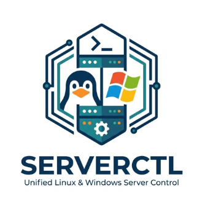

<p align="center">
  
</p>

<h1 align="center">ServerCTL</h1>

<p align="center">
  A self-hosted infrastructure management dashboard.<br/>
  Monitor, manage, and remotely access your servers from a single web interface — no VPN, no inbound ports required.
</p>

<p align="center">
  
  
  
  
  
  
</p>

---

## Features

- **Real-time monitoring** — CPU, RAM, disk, network, uptime across all servers
- **Package updates** — view pending updates, install upgrades per-server or in bulk with selective checkboxes
- **Reboot management** — identify servers requiring reboot, reboot selectively with confirmation
- **SSH terminal** — browser-based SSH shell via WebSocket (Linux servers)
- **RDP remote desktop** — browser-based RDP via FreeRDP + noVNC (Windows servers)
- **Service management** — start, stop, restart and inspect systemd / Windows services
- **Log viewer** — browse and read log files remotely (`/var/log/` on Linux, Event Log on Windows)
- **Probe Monitor** — test connectivity via Ping, TCP, UDP, HTTP, or DB port with per-result tooltips
- **Network scanner** — discover active hosts on any subnet
- **Speed test** — measure download speed to package repositories or CDN endpoints
- **Scheduled tasks** — run recurring commands on a cron schedule
- **Bulk actions** — upgrade, reboot, or update agents across multiple servers at once
- **Agent management** — dedicated Agents tab with selective update checkboxes, version tracking, and one-click updates
- **User management** — role-based access control (admin / user)
- **Custom branding** — upload your own logo and set a custom dashboard title
- **Theme system** — dark and light themes with multiple accent colors
- **Collapsible sidebar** — toggle sidebar between expanded and icon-only mode, auto-collapses on narrow viewports
- **Windows support** — native Go agent with automatic PSWindowsUpdate module installation for Windows Update detection
- **No inbound ports** — agents connect outbound to the backend over WebSocket

---

## Architecture

```
Browser
  └── Frontend  (React + Vite, served by nginx)
        └── Backend API  (FastAPI + Python)
              ├── WebSocket hub
              │     └── Agent  (Go binary, runs on each managed server)
              └── RDP Bridge  (FreeRDP + TigerVNC + noVNC)
                    └── WebSocket → VNC proxy for browser-based RDP
```

- **Frontend** — React SPA, Vite build, served by nginx, noVNC client bundled for RDP
- **Backend** — FastAPI, manages agent WebSocket connections, proxies commands and RDP sessions
- **RDP Bridge** — FreeRDP renders RDP to a virtual X display (TigerVNC), proxied over WebSocket to the browser via noVNC
- **Agent (Linux)** — pre-compiled Go binary, runs as a systemd service, connects outbound via WebSocket
- **Agent (Windows)** — pre-compiled Go binary, runs as a Windows Service, connects outbound via WebSocket

---

## Tech Stack

| Component | Technology | Version |
|-----------|-----------|---------|
| Frontend | React + Vite | React 18.3, Vite 6.0 |
| Backend | FastAPI + Uvicorn | Python 3.13 |
| Agent | Go (cross-compiled) | Go 1.24 |
| Database | SQLite | 3.x |
| Terminal | xterm.js | 6.0 |
| RDP | FreeRDP + TigerVNC + noVNC | noVNC 1.5.0 |
| Deployment | Docker Compose | - |

---

## Requirements

### Docker Mode (recommended)
- **Docker + Docker Compose** — on the host running ServerCTL

### Native Mode (no Docker)
- **Python 3.8+** and **Node.js 18+** — on the host running ServerCTL
- **nginx** — for serving the frontend and reverse proxying the backend
- **FreeRDP + TigerVNC** — for browser-based RDP (installed automatically by `setup.sh`)

### Managed Servers
- **Outbound internet access** — managed servers must be able to reach the ServerCTL host on the backend port
- No inbound firewall rules needed on managed servers
- No dependencies required — the agent is a single static binary

---

## Quick Start

```bash
git clone https://github.com/vladII987/ServerCTL.git
cd ServerCTL
bash setup.sh
```

Dashboard will be available at:
```
http://<your-host>:<FRONTEND_PORT>
```
Default frontend port: **8090**. Default backend port: **8765**.

**Default credentials:** `admin` / `admin` — change immediately after first login.

---

## Setup (`setup.sh`)

The interactive setup script handles first-time installation and configuration. It supports both Docker and native Linux deployment modes.

### What It Does

**Step 1 — Deployment mode**
Choose between **Docker** (recommended) or **Native** (direct install on Linux).

**Step 2 — Port configuration**
- **Frontend port** (default `8090`) — the port you open in your browser
- **Backend port** (default `8765`) — the API and WebSocket port that agents connect to

**Step 3 — Token generation**
Three secrets are generated automatically using `openssl rand -hex 32`:
- **AGENT_TOKEN** — shared secret for agent authentication (each server also gets a unique per-server token)
- **DASHBOARD_TOKEN** — legacy admin fallback token (superseded by user accounts)
- **SECRET_KEY** — JWT signing key for user session tokens

**Step 4 — Prometheus (optional)**
You can optionally provide a Prometheus URL (default: `http://localhost:9090`). Prometheus is used as an **alternative metrics source** — if configured, the backend queries Prometheus for CPU, RAM, and disk metrics instead of relying solely on agent-reported data. This is useful if you already run Prometheus with `node_exporter` on your servers. If Prometheus is not configured or unreachable, the backend falls back to agent metrics automatically.

**Step 5 — SSL/HTTPS**
Three options:
- **None** — plain HTTP only (default)
- **Self-signed** — generates a 10-year self-signed certificate, good for internal/lab environments. Enables clipboard support in browser-based RDP sessions (clipboard API requires HTTPS).
- **Let's Encrypt** — free trusted certificate with automatic renewal, requires a public domain name pointing to the server

SSL settings are persisted in `.env` so they survive rebuilds and updates.

**Step 6 — Build and start**
- **Docker mode:** installs Docker if needed, runs `docker compose up --build -d` (three containers: backend, rdpbridge, frontend)
- **Native mode:** creates Python venvs, builds the frontend with Vite, configures nginx as reverse proxy, creates systemd services (`serverctl-backend`, `serverctl-rdpbridge`)

### Environment File

All configuration is written to `.env` in the project root (never committed to git):

| Variable | Required | Description |
|----------|----------|-------------|
| `AGENT_TOKEN` | Yes | Shared agent authentication secret |
| `DASHBOARD_TOKEN` | Yes | Legacy token-based login fallback |
| `SECRET_KEY` | Yes | JWT signing secret for user sessions |
| `BACKEND_PORT` | No | Backend API port (default: `8765`) |
| `FRONTEND_PORT` | No | Frontend web port (default: `8090`) |
| `PROMETHEUS_URL` | No | Prometheus endpoint for metrics (falls back to agent metrics if empty) |
| `PUBLIC_HOST` | No | Public IP/hostname for agent install URLs (auto-detected) |
| `SSL_MODE` | No | `none`, `selfsigned`, or `letsencrypt` (default: `none`) |
| `SSL_CERT_PATH` | No | Path to SSL certificate (set automatically) |
| `SSL_KEY_PATH` | No | Path to SSL private key (set automatically) |

---

## Updating (`update.sh`)

```bash
sudo bash update.sh
```

The update script safely upgrades ServerCTL to the latest version while preserving your configuration and data.

### What It Does

1. **Validates environment** — checks that `.env` exists and contains required tokens (`SECRET_KEY`, `DASHBOARD_TOKEN`, `AGENT_TOKEN`)
2. **Creates backup** — copies `.env`, database, and config files to `.backup/<timestamp>/`
3. **Pulls latest code** — offers three methods: HTTPS (public), HTTPS with credentials, or SSH
4. **Auto-detects SSL** — if SSL certificates exist but `SSL_MODE` is missing from `.env`, adds it automatically
5. **Rebuilds**:
   - **Docker mode:** runs `docker compose up --build -d` and prunes old Docker images to free disk space
   - **Native mode:** updates Python dependencies, rebuilds the frontend, restarts the backend service, reloads nginx
6. **Reports version** — shows the upgrade path (e.g., `1.3.0 → 1.4.0`)

---

## Uninstalling (`uninstall.sh`)

```bash
sudo bash uninstall.sh
```

Completely removes ServerCTL from the system.

- **Docker mode:** stops and removes all containers, images, volumes, and the `.env` file
- **Native mode:** stops and removes systemd services, removes nginx config, deletes Python venvs and frontend build, removes `.env`

Optionally deletes the entire project directory.

---

## Manual Setup

```bash
cp .env.example .env
# Edit .env and fill in token values
export APP_VERSION=$(cat VERSION)
docker compose up --build -d
```

---

## Docker Compose Services

| Service | Container | Default Port | Purpose |
|---------|-----------|--------------|---------|
| `backend` | serverctl-backend | `8765` | FastAPI API server + WebSocket hub |
| `rdpbridge` | serverctl-rdpbridge | `8080` (internal) | FreeRDP + TigerVNC remote desktop proxy |
| `frontend` | serverctl-frontend | `8090` | nginx serving the React SPA |

All containers communicate on the `guac-net` bridge network. Agent binaries in `agent-go/dist/` are mounted read-only into the backend container.

**Persistent data:**
- `./data/` — SQLite database (servers, users, settings)
- `.env` — all secrets and configuration

---

## Adding a Managed Server

1. Open the dashboard → **Servers** → **+ Add Server**
2. Fill in server name, host/IP, and select OS (Linux or Windows)
3. Copy the generated install command
4. Run it on the target server

**Linux** (run as root):
```bash
curl -fsSL "http://<serverctl-host>:<BACKEND_PORT>/api/agent/install?token=<TOKEN>&server_id=<ID>" | sudo sh
```

**Windows** (PowerShell as Administrator):
```powershell
iex (iwr -UseBasicParsing "http://<serverctl-host>:<BACKEND_PORT>/api/agent/install-windows?token=<TOKEN>&server_id=<ID>").Content
```

The installer downloads a single static Go binary, writes config, and creates a system service. The agent appears online in the dashboard within seconds.

---

## Bulk Deployment with Ansible

For deploying agents across many servers at once, use the included Ansible playbooks.

### `deploy-agent.yml`

Registers servers with the backend API and installs the agent on each host.

```bash
ansible-playbook -i inventory/hosts.yml deploy-agent.yml --ask-pass
ansible-playbook -i inventory/hosts.yml deploy-agent.yml --ask-pass --limit server-05
```

Edit the variables at the top of the playbook:
- `backend_url` — backend HTTP URL (e.g., `http://192.168.1.100:9090`)
- `backend_token` — admin dashboard token for the registration API
- `serverctl_ws_url` — WebSocket endpoint for agents (e.g., `ws://192.168.1.100:9090/ws/agent`)

### `update-token.yml`

Rotates agent tokens on existing installations without reinstalling.

```bash
ansible-playbook -i inventory update-token.yml
ansible-playbook -i inventory update-token.yml --limit 192.168.1.201
ansible-playbook -i inventory update-token.yml --check   # dry run
```

Updates `/etc/serverctl/config.yml` on each server, creates a backup of the old config, and restarts the agent service.

### Inventory Generation (`gen-inventory.py`)

Generates an Ansible-compatible inventory file from the ServerCTL server registry.

```bash
python3 gen-inventory.py                          # print to stdout
python3 gen-inventory.py -o inventory/hosts       # write to file
python3 gen-inventory.py --user root              # specify SSH user
python3 gen-inventory.py --skip-ips 192.168.1.1   # exclude gateway IPs
```

Reads servers from the database, filters out gateway IPs, and outputs an `[agents]` group with per-server tokens.

### Network Scanner (`scan.py`)

Discovers active hosts on local subnets and optionally imports them as managed servers.

```bash
python3 scan.py
```

- Scans configurable subnets using async ICMP ping (default: `192.168.0.0/24`, `192.168.1.0/24`, `172.16.0.0/16`)
- Checks each host for an existing agent health endpoint
- Interactive selection: import all, only those with agents, or specific hosts
- Saves results to the server registry with auto-generated IDs and groups

---

## Updating Agents

**Agents tab** (recommended):
- View all connected agents with version, platform, and status
- Select specific agents using checkboxes → **Update Selected**
- Or use **Select All / Deselect All** for bulk operations

**Per-server:** Manage a server → **Actions** tab → **Update Agent**

---

## Agent — Supported Commands

The Go agent executes only an explicit allowlist of commands. No arbitrary shell execution is possible.

| Command | Description |
|---------|-------------|
| `system_info` | Basic system info (hostname, OS, kernel, uptime) |
| `sysinfo_json` | Full system info as structured JSON |
| `disk_usage` | Disk space per partition |
| `memory` | RAM and swap usage |
| `cpu_info` | CPU model, cores, architecture |
| `top_processes` | Processes sorted by CPU usage |
| `netstat` | Active network connections |
| `ip_info` | Network interfaces and addresses |
| `listening_ports` | Open listening ports |
| `firewall_status` | Firewall rules (iptables/nftables on Linux, Windows Firewall) |
| `list_services` | All services (systemd on Linux, Windows services) |
| `service_status` | Status of a specific service |
| `docker_ps` | Running Docker containers |
| `list_logs` | Available log files |
| `view_log` | Read a log file or Windows Event Log |
| `update` | Refresh package index |
| `upgrade` | Full package upgrade (apt/dnf/yum/zypper or Windows Update) |
| `upgradable_packages` | List packages with available upgrades |
| `check_reboot` | Check if reboot is required |
| `reboot` | Reboot the server |
| `update_agent` | Download latest agent binary and restart service |
| `uninstall_agent` | Remove agent and its configuration |
| `ping_count` | ICMP ping to a target |
| `traceroute` | Traceroute to a target |
| `nslookup` | DNS lookup |
| `kill_process` | Terminate a process by PID |
| `repo_speedtest` | Test download speed to package repos / CDN |

**Linux package managers:** `apt`, `dnf`, `yum`, `zypper` (auto-detected)
**Windows updates:** Uses `PSWindowsUpdate` PowerShell module (auto-installed by the agent if missing)

---

## User Management

Manage users via **Settings → User Management** (admin only).

| Role | Permissions |
|------|-------------|
| `admin` | Full access — add/delete servers, manage users, run upgrades and reboots |
| `user` | Read access + add servers — no delete, no upgrades, no reboots |

---

## Versioning

The app version is defined in a single file: **`VERSION`**

All components read from it:
- `docker-compose.yml` — via `${APP_VERSION}` env var
- `backend/main.py` — reads `/app/VERSION` at runtime
- `agent-go/Makefile` — reads `../VERSION` and injects via `-ldflags`

To bump the version, edit `VERSION` and rebuild.

---

## Building Agent Binaries

Agent binaries are pre-compiled and included in `agent-go/dist/`. To rebuild:

```bash
cd agent-go
make all      # Builds linux-amd64, linux-arm64, and windows-amd64
```

Individual targets: `make linux`, `make windows`, `make deb`, `make rpm`

Requires **Go 1.24+** installed on the build machine.

---

## Project Structure

```
ServerCTL/
├── frontend/                 # React app (Vite)
│   ├── public/
│   │   └── logo.png          # Default logo
│   └── src/
│       ├── Dashboard.jsx     # Main UI component
│       ├── main.jsx          # App entry point
│       ├── index.css         # Design system, CSS variables, base styles
│       ├── themes/           # Accent color theme definitions
│       └── novnc/            # noVNC ESM source (downloaded at build time)
├── backend/                  # FastAPI backend
│   ├── main.py               # API routes, WebSocket hub, agent installer scripts
│   ├── config.py             # Settings (pydantic-settings, reads from .env)
│   ├── database.py           # SQLite database layer
│   ├── server_registry.py    # In-memory server registry with SQLite persistence
│   ├── users.py              # User management, JWT auth
│   ├── rdp_handler.py        # RDP WebSocket proxy (FreeRDP bridge)
│   ├── ssh_handler.py        # SSH WebSocket proxy
│   ├── scanner.py            # Network subnet scanner
│   └── requirements.txt
├── rdpbridge/                # FreeRDP + TigerVNC RDP bridge
│   ├── Dockerfile
│   └── manager.py            # WebSocket → VNC session manager
├── agent-go/                 # Go agent (cross-platform)
│   ├── main.go               # Agent source code
│   ├── go.mod
│   ├── Makefile              # Build targets: linux, windows, deb, rpm
│   └── dist/                 # Pre-compiled binaries
├── deploy-agent.yml          # Ansible playbook — bulk agent deployment
├── update-token.yml          # Ansible playbook — rotate agent tokens
├── gen-inventory.py          # Generate Ansible inventory from server registry
├── scan.py                   # Network scanner — discover and import hosts
├── setup.sh                  # First-time setup (Docker or Native mode)
├── update.sh                 # Update to latest version with backup
├── uninstall.sh              # Complete removal
├── docker-compose.yml
├── VERSION                   # Single source of truth for app version
├── .env.example
└── LICENSE                   # CC BY-ND 4.0
```

---

## Development

```bash
# Backend
cd backend
pip install -r requirements.txt
uvicorn main:app --reload --port 8765

# Frontend
cd frontend
npm install
npm run dev
```

---

## Security Notes

- All agent commands go through an explicit allowlist — no shell injection possible
- Agent tokens are per-server and stored in the backend database
- Agents connect outbound only — no inbound ports needed on managed servers
- HTTPS is supported via setup.sh (self-signed or Let's Encrypt) or a reverse proxy
- The backend port should not be exposed directly to the internet
- `DASHBOARD_TOKEN` is a legacy fallback — prefer named user accounts
- Change the default `admin` / `admin` credentials immediately after first login

---

## Documentation

Full documentation for all features, tabs, and controls: **[DOCS.md](DOCS.md)**

---

## License

[CC BY-ND 4.0](LICENSE)
